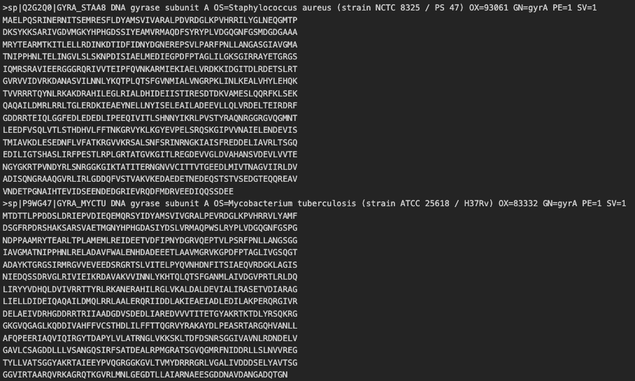
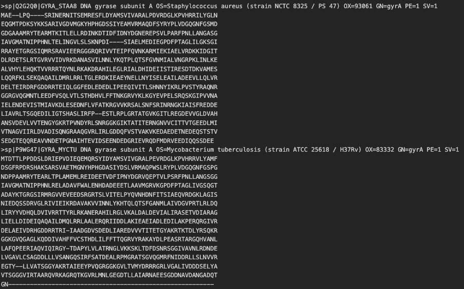

# Multiple Sequence Alignment

Multiple sequence alignment (MSA) is a integral part of bioinformatics where two or more nucleotide or protein sequence can be aligned together. This MSA can be used to infer phylogenetic trees and the evolutionary relationships between sequences.

This small tutorial will use two bacterial gyrase subunit A (*gyrA*) protein sequences from M tuberculosis ATCC 25618 (Accession: P9WG47) and S. aureus NCTC 8325 (Accession: Q2G2Q0). The alignment algorithim is mafft.

## Prerequisite 

* MAFFT (or any other multiple sequence aligner)

## Installation

```sh
conda install -c bioconda mafft
```

## Preprocessing

Ensure your sequences are in a multi-fasta format (i.e.)

```
>header
AAAAAAACCCCDDDD
>header
AAAACCCCDDDD
```



## Usage
Assuming your multi-fasta file is  called `msa.fa`, run the following command

```
mafft --auto --thread 1 msa.fa > msa.out.fa
```

where `msa.out.fa` is the output alignment file. The output also follows a multifasta format, but with misalignments between sequences marked with a `-` 



## Notes

* `--thread <int>` controls how many threads to run mafft on, for larger sample sizes, enter a larger number.
* `>` redirects the fasta file into the file after the symbol.


[back](../)