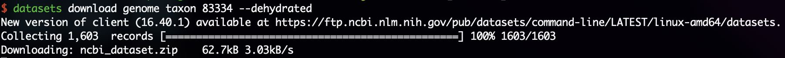
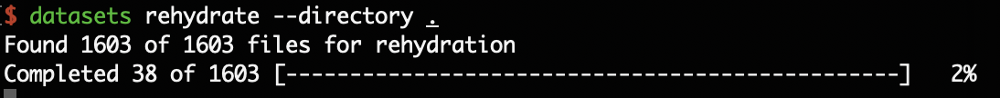

# Getting genomes from NCBI

This is a short tutorial on getting genomes from NCBI using the [datasets](https://www.ncbi.nlm.nih.gov/datasets/docs/v2/command-line-tools/download-and-install/) CLI tool. I will be using *E. coli* O157:H7 (Tax id: 83334) as an example.

## Prerequisite 

* Conda

## Installation

```sh
conda install -c conda-forge ncbi-datasets-cli
```

## Usage

1. Call the dataset command and specify the tax id as 83334 (*E. coli* O157:H7)

    ```sh
    datasets download genome taxon 83334 --dehydrated
    ```

    The `dehydrated` flag downloads a "dehydrated" index file for later use. This is generally good practice to use this method, especially for larger datasets to prevent corruption.

    

2. Unzip the downloaded dehydrated file

    ```sh
    unzip ncbi_dataset.zip
    ```

3. Rehydrate the unzipped contents. You should specify to the path where the file is unzipped.

    ```sh
    datasets rehydrated --directory .
    ```

    You should see in the example, 1603 files will be downloaded.

    *Note: if for any reason the connection is severed or the job is prematurely terminated, invoke the same command to resume the job. The index file will automatically pick up where the job last left.*

    *Note: This also extends to missing files. For any reason the files are removed or moved away from the original download directory, invoking the command will regenerate the missing files. Neat.*

    

    Your genomes will be in the `./ncbi_dataset/data/` directories.

[back](../)