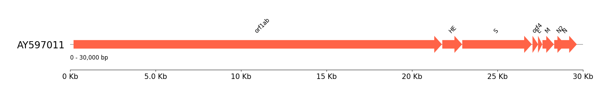

# Plotting Genome

> "We can see only a short distance ahead, but we can see plenty there that needs to be done." - Alan Turing. 1 October 1950, Computing Machinery and Intelligence

Pygenomeviz is a powerful genome visualiser with a high degree of flexibiliity and customisability. Using SARS-COV HKU 1 (Accession: AY597011) as toy data, here is how to plot a sample genome in GenBank format. 

Coronavirus is used as a toy example because of its simplicity and small genome size, but pygenomeviz can easily handle much larger genome segments.


## Prerequisite 

* Python >= 3.9

## Installation

```sh
pip install pygenomeviz
```

## Usage

1. Import package and set genomeviz object

    ```python
    from pygenomeviz import GenomeViz
    from pygenomeviz.parser import Genbank
    gv = GenomeViz()
    ```

2. Assuming your GenBank file is in the same directory with the name `AY597011.gb`.

    ```python
    gbk = Genbank("./AY597011.gb")
    ```

3. Set plot track + segment regions

    Segment size is set to 30000 because the genome region is about 30kb-ish. In practice you'd probably want to set it to something like `np.ceil(len(sequence_string))`.

    ```python
    gv = GenomeViz(fig_track_height=0.5)
    gv.set_scale_xticks(start=0)

    track = gv.add_feature_track(name="AY597011", segments=(0, 30000))
    track.add_sublabel()
    segment = track.get_segment()
    ```

4. Plot the genome using "CDS" as genome regions and "gene" as the names. Again, in practice you'd probably want to colour different gene based on the gene_name or other identifier. I use an orange colour just as an example.

    ```python
    for feature in gbk.extract_features("CDS", target_range=segment.range):
        gene_name = str(feature.qualifiers.get("gene", [""])[0])
        segment.add_features(feature, plotstyle="bigarrow", color="tomato", label_type="gene")
    ```

5. Plot and Save.

    ```python
    fig = gv.plotfig()
    gv.savefig("./AY597011.png")
    ```
    

[back](../)