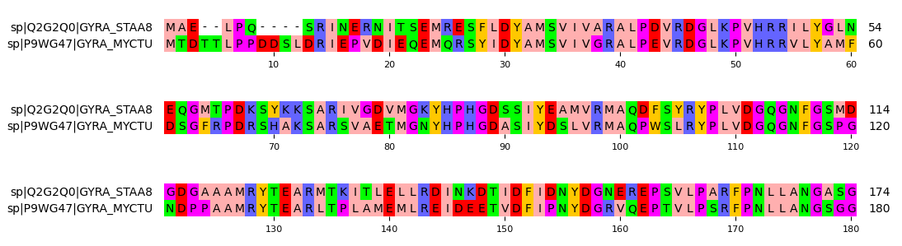

# Plotting MSA

pymsaviz is a great local and offline multiple sequence alignment (MSA) viewer and plotter to the [NCBI online MSA viewer](https://www.ncbi.nlm.nih.gov/projects/msaviewer/). No frills, easy to install and use and is fantastic for publication uses.

I will be using the [example](../basics/msa.md) to visulise the alignment.

## Prerequisite 

* Python >= 3.9

## Installation

```sh
pip install pygenomeviz
```

or

```sh
conda install -c conda-forge -c bioconda pymsaviz
```

## Usage


1. Import package
    ```python
    from pymsaviz import MsaViz
    ```

2. Assuming you have run a MSA with an output file called `msa.out.fa` in the same directory
    ```python
    msa_file = "./msa.out.fa"
    ```

3. Create the MSA object.
    ```python
    mv = MsaViz(msa_file, wrap_length=60, show_count=True)
    ```

4. Plot and Save.
    ```python
    mv.savefig("./msa_plot.png")
    ```

You should see an output like this. (excerpt)


[back](../)