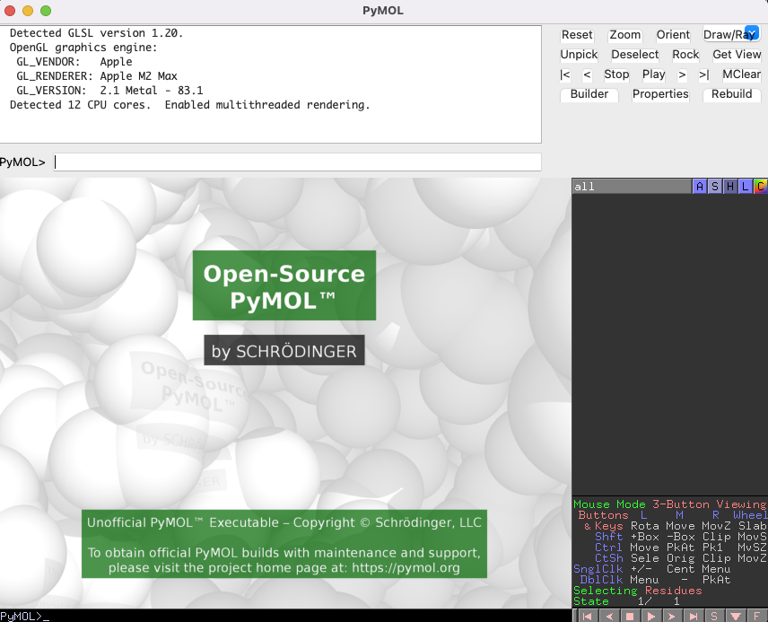
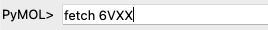
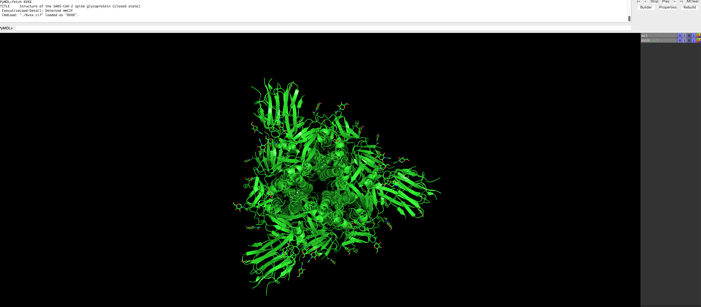
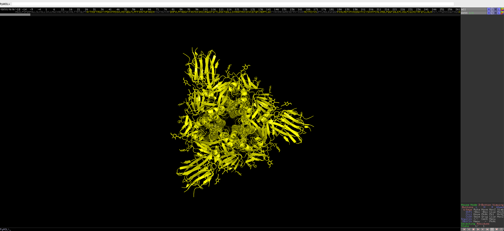
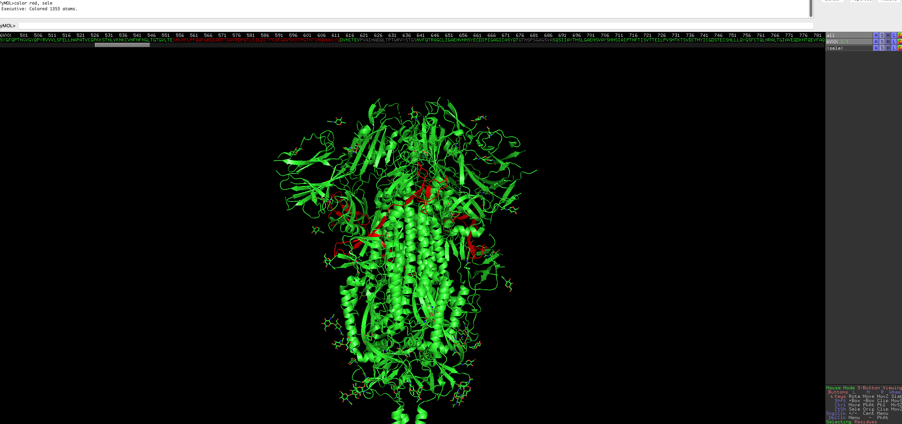
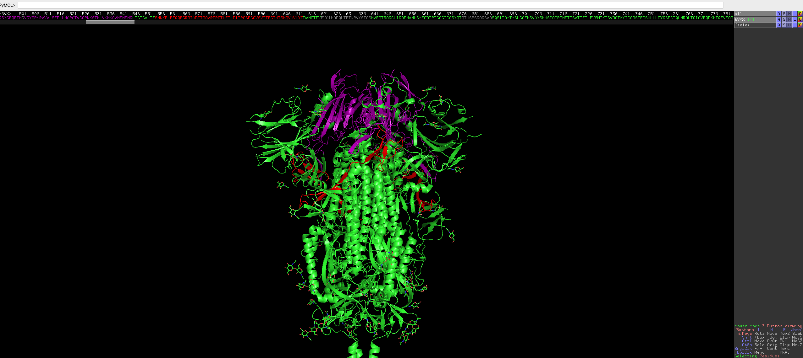

# PyMOL basics

> "Fate will unwind as it must!" - Beowulf

PyMOL is one of the best protein visualisation program out there. Using the [SARS-CoV-2 spike protein](https://www.rcsb.org/structure/6vxx) as an example, we will go through the basics of PyMOL. PyMOL is a paid program that requires a license, but an ["unofficial" open source version](https://github.com/schrodinger/pymol-open-source/) by the authors is also available. 

## Prerequisites

* Conda

## Installation

```
conda install conda-forge::pymol-open-source
```

### Usage

1. Simply invoke 
    
    ```sh
    pymol
    ```

    from your terminal

    You should see the interface pop up. I am running this from a M2 max Macbook Pro.

    

2. Fetch the SARS-CoV2 Spike protein pdb file using the `fetch` command

    ```python
    fetch 6VXX
    ```

    

    You will see the protein load into the graphical user interface.

    

    Feel free to rotate and move the protein around, and look at the protein structure.

    By default, the protein is a trimer and is represented as such.

3. We can change the colour of the proteins by selecting the `c` box next to `6VXX`, under `all` on the right side.

    Select a colour of your choice.

4. Press the `S` box on the bottom right hand of the GUI. This will show the sequence of the protein.

    

5. Now we want to colour some regions of interest.
    
    Residues 555 to 613 is annoatated as C-terminal, 367 to 545 is annotated as the receptor binding region. 

    Select the region of the residue using the following command

    ```python
    select resi 555-613
    ```

    You will see pink dots now covering the selected residues, it will also show up on the sequence bar. (if you have it enabled)
    
    You will also see a now bar on the right called `(sele)`

6. You can colour the selection with colors of your choice using the following, in this case red:

    ```python
    color red, sele
    ```

    The residues of selected region will be red, the residues on the bar will also be coloured accordingly.

    

    Repeat it for the receptor binding region.

    ```python
    select resi 367-545
    color purple, sele
    ```

    *Note: colour name must be one those from a [predefined list](https://pymolwiki.org/index.php/Color_Values), but you can defined custom colours, but is out of scope of this blog.*

    After this, have a look at the protein, does the coloured region make sense? 
    
    
    
    Looks great!

7. After everything you can export the image using the top right `draw/ray` box.

There are advanced methods you can use by looping through angles and making images at different rotations. Stitching the images together effectively makes a gif of a rotating protein!

[back](../)