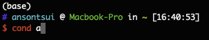

# Oh my ZSH

I am personally a avid fan of [Oh my zsh](https://ohmyz.sh/), it makes my life navigating the command line and working with code in general way better. As an added bonus, it gives you flair and you can custom your interface to your heart's desire. When you are staring at this for 8+ hours per day, it better be an eye-candy.

By default, macOS ships with zsh, so you will not be editing anything too major. On other linux distros, you may be using bash. Don't worry, in terms of compatibility zsh is near identitcal, so you do not need to learn specialised syntax or keywords when navigating zsh.

## Things I like about oh my zsh

### Syntax highlighting

The ["Syntax Highlighting"](https://github.com/zsh-users/zsh-syntax-highlighting/blob/master/INSTALL.md) add-on to oh my zsh is a godsend in terms of accessibility and usability. It highlights valid syntax as green and erroneous syntax as red; Green means good and red means bad

For example, a basic command like 
``` sh
conda
```

will show up as:


where as if you fat-fingered an extra space into your command, it will show up as:



It also works for pipe and loooooooooong command chains:


This function doubles as a soft checker to see if you have successfully installed new commands through assigning the command to your PATH. It can serve as a sanity check to ensure everything on the surface works as intended.

### Z plugin

The Z plugin is another godsend when navigating and I basically can't live with it ever since. It does away the extremely verbose and long file paths when navigating through it. Z basically learns the most commonly used paths you ```cd``` into and allows you to type a fragment of the path to immediately move into it.

It adds the ```z``` command, where the syntax is:
```
z <keyword>
```
The keyword is a fragment or path to your directory of choice. 

For example:

My project directory is in ```/mnt/storage/projects/bacteria/``` where I have projects ```AABBCC``` and ```DDEEFF``` respectively. Instead of typing the entire path, I can just type ```z AABBCC``` and entering the desired directory

Better yet, if you so happen to have two directories in different places called ```AABBCC```, by typing ```z AABBCC``` and pressing \<TAB\> you can select which ```AABBCC``` to enter

### Flair galore

A nice to have with oh my zsh is the option of customising your terminal to your liking. With a long [list](https://github.com/ohmyzsh/ohmyzsh/wiki/themes) of custom themes to choose from, your terminal will better suit your tastes and perference.


## My setup
* Theme: ```ys```
* Plugins: ```z, git```

[back](../)