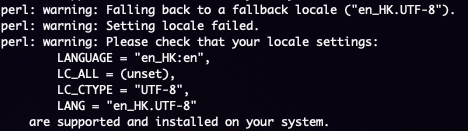

# Solving Perl Language Locale Problem

When working in bioinformatics, you will almost certainly run into the perl locale error, which looks like this.



Worse yet, this error persists every time a perl script is called, which will lead to your terminal being flooded with this warning message.

You **could** just ignore it, but it can become annoying very quickly.


## Quickfix

Using the example image above, the problem lies in the LC_all variable being unset.

``` sh
export LC_ALL="en_HK.UTF-8"
```

sets the `LC_ALL` variable to the corresponding locale. In this case, it's en_HK.UTF-8.

*Note: this is a temporary fix and will reset everytime you restart your shell*

A more "permanent" fix for this would be to set the environmental variable.

Assuming you are inside your conda environment that is facing this issue, run:

```sh
conda env config vars set LC_ALL="en_HK.UTF-8"
```

This will ensure the locale is set everytime you activate the environment and fix the warning message.

[back](../)