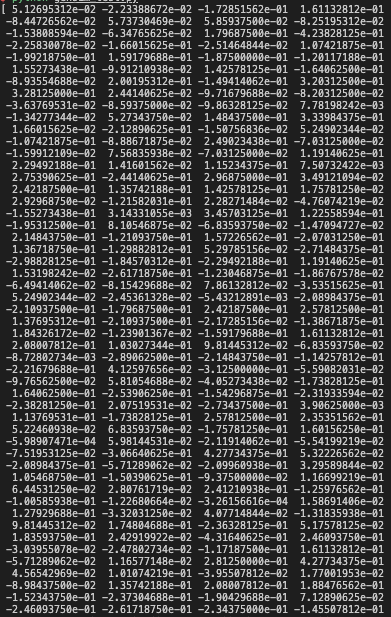
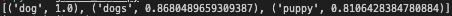

# Natural language processing: Word2Vec

In natural language processing, individual words can be embedding into vectors based on a pretrained model. One such pretraining algorithm is word2vec proposed by [Mikolov et al.](https://arxiv.org/abs/1301.3781) from Google in 2013. Although a bit outdated and outperformed by more sophisticated models, word2vec vectors has some interesting properties that reveal about our written/spoken language.

## Prerequisite 

* gensim 
* scipy

## Installation

```sh
pip install gensim
pip install scipy
```

## Usage

1. Import gensim and load the word2vec model

    ```python
    import gensim.downloader as api
    model = api.load('word2vec-google-news-300')
    ```

    This will download the word2vec pretrained word vector model (when initializing for the first time) pretrained on the Google News dataset containing about 100 billion words. The vocabulary is about 3 million words.

2. Word embeddings can be retrieved by parsing word into the model.

    Example: the word 'dog'
    
    ```python
    dog = model['dog']
    print(dog)
    ```

    will yield a vector like this

    

    Running

    ```python
    print(dog.shape)
    ```

    will yield a vector of size (300,). This means that each word that gets parsed into word2vec will be embedded into a vector with 300 dimensions. These values are on a continous scale (i.e. float values) that captures the semnatic meaning of the word embedded.

3. You can retrieve words that are most similar to the word 'dog' by using

    ```python
    print(model.most_similar([dog], topn = 3))
    ```

    This retrieves the 3 words that resembles most like the word 'dog'. Adjust the topn variable to retrieve the top-n most similar words.

    Output: `[('dog', 1.0), ('dogs', 0.8680489659309387), ('puppy', 0.8106428384780884)]`

    

    The most similar 3 words to the word 'dog' are 'dog', 'dogs' and 'puppy'. This does make sense, albeit a bit useless, as the first two words are just reiterating the same word and its plural form. 
    
    The 3rd most similar word 'puppy' reveal that 'dog' and 'puppy' are similar, which is logical as the latter is the young of the former.

4. You can get the distance between two vectors by using scipy. (Other methods are available)

    ```python
    import scipy.spatial.distance as dist
    
    print(dist.euclidean(model['dog'], model['cat']))
    ```

    This will give the distance of the elucidean distance between the vector embeddings for the words 'dog' and 'cat'.

    output: `2.081533670425415`

5. Interesting stuff happens when we do some linear operations on a combination of these vectors that reveal more about the semantics of the embeddings.

    ```python
    test_vec = model['queen'] - model['woman'] + model['man']
    assert test_vec.shape == (300,) #ensure that the ouput vector is of shape (300,)
    ```

    Here we remove the vector encoding for the term 'woman' from the word 'queen' and add 'man' to it.

    ```python
    print(model.most_similar([test_vec], topn = 3))
    ```

    Will yield

    Output: `[('queen', 0.8393025994300842), ('king', 0.7046408653259277), ('queens', 0.6252749562263489)]`

    The resulting vector from our operation most resembles the words `queen`, `king` and `queens`. While the most similar word is just the reiteration of the word `queen`. The second word `king` is fascinating. It makes linguistic and logical sense when you remove the concept of `woman` from the word `queen` and reintroduce `man`, the resulting output would somewhat resemble `king`. This implies that in the 300-dimension vector, there are vector(s) that encodes for concepts of gender and royalty.

*Note: While this example shows embeddings in action quite well, the underlying training dataset comes from the google news dataset, which introduces biases. Words that are commonly used in news are overrepresented while other words are under-represented.* 

*Note 2: This example does not work for words that are not in the vocabulary*

```python
try:
    print(model['mussolini'])
except:
    print('The word is not found')
```

Output: `The word is not found`

will reveal that the word italin dictator `mussolini` is not in the corpus. 

Another example showing this bias is by running:

```python
print(model.most_similar([model["science"]], topn = 3))
```

Will yield

`[('science', 1.0000001192092896), ('faith_Jezierski', 0.6965422034263611), ('sciences', 0.6821076273918152)]`

Which is quite strange. What is `faith_Jezierski` doing near the vector for `science`?

It turns out that this vector might be related to the news that Copernicus, the astronomer who proposed the heliocentric system, was buried with catholic honours in 2010. This made the rounds in the news, prompting the model to pick up `faith_Jezierski` to be associated with the word `science`. Jezierski likely refers to Jacek Jezierski, a Polish bishop that pushed for the posthumous recognition of Copernicus, and that this name is also referenced in the news.

This shows that the training corpus of pre-trained models will influence the embeddings of your queries, and most likely introduce biases.

# Reference

1. https://arxiv.org/abs/1301.3781
2. https://code.google.com/archive/p/word2vec/

[back](../)
