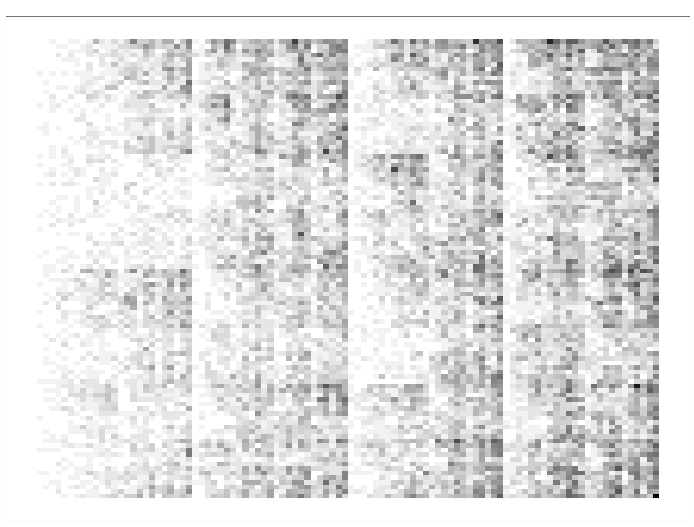
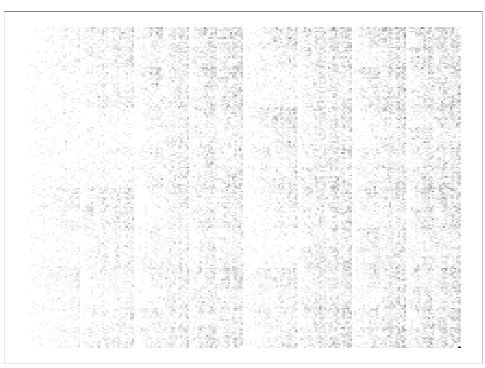
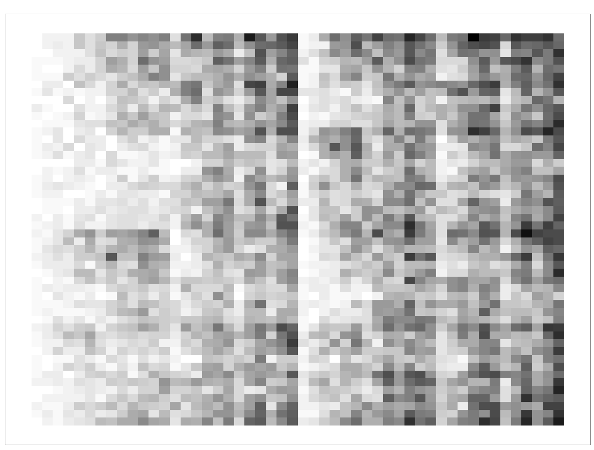

# Chaos Game Representation of Nucleic Acid Sequences

Chaos game representation is a method to convert a sequence of nucleic acid into a 2D matrix of points. First proposed by [Jeffrey](https://doi.org/10.1093/nar/18.8.2163) in 1990. Chaos game representation allows for the conversion of a linear sequence of nucleic acid into a 2D matrix of points, highlighting both local and global patterns in the sequence.

This method can be extended into protein amino acid sequence where the chaos game representation can be presented as a n-flake structure, resembling a snowflake. This is adapted in the `kaos` package from [Lochel et al.](https://doi.org/10.1093/bioinformatics/btz493).

## Prerequisite 

* R (>= 4.1.0)
* BioStrings package and dependencies

## Installation

```r
install.packages('kaos')
```

## Usage

0. Load libraries and dependencies

    ```r
    library(kaos)
    library(Biostrings)
    ```

1. Define a function that ingests fasta file and returns a vector with the nucleotide sequence as a vector.

    ```r
    read_fasta <- function(file){
        fastafile <- redDNAStringSet(file, format = "fasta")
        seqname <- names(fastafile)
        seq <- paste(fastafile)
        info <- c(seqname, seq)
        return(info)
    ```

    Note that R functions cannot return more than 1 element, compared to other programming languages such as python. 

    We have to combine the information into a vector and return this using `info <- c(seqname, seq)`. We can access the elements out of the context of the function by using `info[1]` and `info[2]` respectively.

2. Define a function that converts a string of DNA/protein sequence into a vector of individual characters.

    ```r
    string_to_vector <- function(seq){
        outvector <- unlist(strsplit(seq, split = "")
        return(outvector)
    }

    This will convert a sequence, for example "ATGC" into a vector of `c("A", "T", "G", "C")`

3. Run the chaos game representation conversion

    Assuming your fasta file is called `sars2.fasta` in the same directory as the script.

    ```r
    file <-  read_fasta("./sars2.fasta")
    test_seq <- string_to_vector(file[2])
    sars2.cgr <- cgr(test_seq, res = 100)
    ```
    
    This will return a list of elements for the chaos game representation.

4. Plot the chaos game representation

    ```r
    cgr.plot(sars2.cgr, mode = "matrix")
    ```

    Outputting using `mode = "matrix"` will give you a matrix of frequency chaos game representation (FCGR), a normalized matrix that is invariant of the length of the sequence.

    Conversely, `mode = "points"` will give you a basic chaos game representation where points represent the coordinates of the sequence.

    

    By tinkering with the `res` parameter in `cgr()`, you can change the resolution of the chaos game representation.

    

    Resolution at 200. `res = 200`

    

    Resolution at 50. `res = 50`

    You can see the images is almost analogous to increasing the resolution of an image, with lower resolution resulting in more pixelated images, and higher resolution resulting in more detailed images.

5. For machine learning tasks, you may want to consider using `vectorize` function to retrieve the FCGR in terms of a vector list. 

    ```r
    sars2.vector <- vectorize(sars2.cgr)
    ``` 

    The resulting vector be a linear vector of size `k * k` where `k` is the resolution as defined in `sars2.cgr <- cgr(test_seq, res = 100)`.

    ```r
    length(sars2.vector)
    ```

    In this case, `k = 100` and the length of the vector is `100 * 100 = 10000`.
    This vector is excellent as a feature vector for machine learning tasks.

# Reference

1. https://doi.org/10.1093/nar/18.8.2163
2. https://doi.org/10.1093/bioinformatics/btz493

[back](../)

