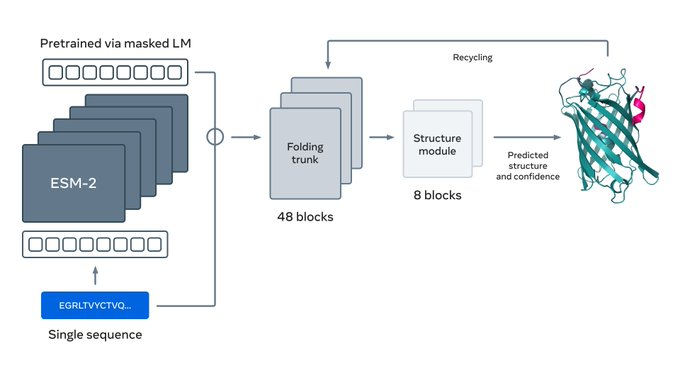

# Prediction of protein structure using ESMFold

ESMFold is a model that uses ESM-2 PLM emebddings as backbone to predict protein structure. While not as accurate as AlphaFold2, ESMFold does not have a hefty computational requirement from multiple sequence alignments and can run extremely quickly.



## Prerequisite

* A cuda-compative nvidia GPU with at least 16GB V-RAM (Video memory)
* pytorch

*Note: at least 16GB is recommended*

The following consumer-grade cards would suffice:
* RTX 3090/3090Ti ampere
* RTX 4080/4080Super/4080Ti
* RTX 4090
* RTX 5070Ti

## Installation

```sh
pip install --upgrade transformers py3Dmol accelerate
```

## Usage

1. Import packages

    ```python
    import torch
    from Bio import SeqIO
    from transformers import AutoTokenizer, EsmForProteinFolding
    from transformers.models.esm.openfold_utils.protein import to_pdb, Protein as OFProtein
    from transformers.models.esm.openfold_utils.feats import atom14_to_atom37
    ```

    *Note: SeqIO is for flavour, while not necessarily needed, it makes reading fasta files and extracting sequences much easier. tqdm is for monitoring progress if you are planning on predicting a lot of sequences*

2. Load model and tokenizer

    ```python
    tokenizer = AutoTokenizer.from_pretrained("facebook/esmfold_v1")
    model = EsmForProteinFolding.from_pretrained("facebook/esmfold_v1", low_cpu_mem_usage=True)
    torch.backends.cuda.matmul.allow_tf32 = True
    model = model.cuda()
    model.esm = model.esm.half()
    ```

    Running this first loads the tokenizer, which turns your protein sequences into tokens to feed into the ESM model. The model is then loaded into cuda. 

3. Optional: define a function for loading fasta

    You are unlikely to directly paste your sequence into the source code. This function allows loading of sequence header for file name and sequence extraction. This scripts covers loading from a fasta file with a single sequence.

    ```python
    def loadfasta(file):
        test_sequences = []
        test_headers = []
        
            with open(file, "r") as readfile:
                for record in SeqIO.parse(readfile, "fasta"):
                    seq = str(record.seq)
                    if len(seq) > 1024: #ESMFold has a sequnece limit of 1024.
                        seq = seq[:1024]
                    test_sequences.append(seq)
                    test_headers.append(record.id)
            return test_sequences, test_headers
    ```

    Then load in your sequences, assuming your single sequence is called `"./data.fa"`

    ```python
    seqs, headers = loadfasta("./data.fa")
    ```

4. Define a function for converting the model outputs into protein database (PDB) files for visualisation.

    ```python
    def convert_outputs_to_pdb(outputs):
        final_atom_positions = atom14_to_atom37(outputs["positions"][-1], outputs)
        outputs = {k: v.to("cpu").numpy() for k, v in outputs.items()}
        final_atom_positions = final_atom_positions.cpu().numpy()
        final_atom_mask = outputs["atom37_atom_exists"]
        pdbs = []
        for i in range(outputs["aatype"].shape[0]):
            aa = outputs["aatype"][i]
            pred_pos = final_atom_positions[i]
            mask = final_atom_mask[i]
            resid = outputs["residue_index"][i] + 1
            pred = OFProtein(
                aatype=aa,
                atom_positions=pred_pos,
                atom_mask=mask,
                residue_index=resid,
                b_factors=outputs["plddt"][i],
                chain_index=outputs["chain_index"][i] if "chain_index" in outputs else None,
            )
            pdbs.append(to_pdb(pred))
    return pdbs
    ```

5. Run ESMFold to predict sequences and output pdb files
    
    ```python
    for seq, header in zip(seqs, headers):
        tokenized_input = tokenizer([seq], return_tensors="pt", add_special_tokens=False)['input_ids']
        tokenized_input = tokenized_input.cuda() #load into GPU
        with torch.no_grad(): 
            output = model(tokenized_input)
    pdbs = convert_outputs_to_pdb(output)
    for pdb in pdbs:
    with open(f"{PDB_DIR}/{header}.pdb", "w") as f:
        f.write("".join(pdb))
    ```

    Assuming PDB_DIR points to your output directory.

6. Assuming you are running a lot of sequences, you may want to import os and tqdm to make extracting sequences and parallelization easier, assuming tqdm is installed.

    ```python
    import os
    from tqdm import tqdm
    #=========================
    #import everything else here
    #define functions
    #=========================
    def main():
        seqs, headers = loadfasta({/PATH/TO/FASTA/FILE})
        
        for seq, header in tqdm(zip(seqs, headers), total=len(seqs)):
            if f"{header}.pdb" in os.listdir(PDB_DIR):
                continue
            else:
                try:
                    print(header, len(seq))
                    tokenized_input = tokenizer([seq], return_tensors="pt", 
                                                add_special_tokens=False)['input_ids']
                    tokenized_input = tokenized_input.cuda()
                    with torch.no_grad():
                        output = model(tokenized_input)
                    pdbs = convert_outputs_to_pdb(output)
                    for pdb in pdbs:
                        with open(f"{PDB_DIR}/{header}.pdb", "w") as f:
                            f.write("".join(pdb))
                except:
                    continue
    main()
    ```

    The try-catch is to prevent any issues from completely bricking your run. It also checks for any already predicted sequences in multiple runs to save resources.


# Reference

1. https://ai.meta.com/blog/protein-folding-esmfold-metagenomics/
2. https://www.science.org/doi/10.1126/science.ade2574
3. https://colab.research.google.com/github/huggingface/notebooks/blob/main/examples/protein_folding.ipynb

[back](../)