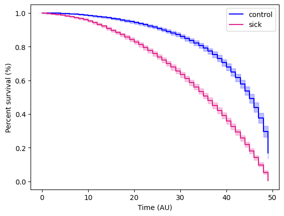

# On survival analysis and KM plots

> "cie la vie"

In the context of biomedical sciences, survival analysis is used to study the relationship between time and outcome. More broadly speaking, 'How likely is a non-reversible process *X* to have happened within *T* time?'.

This process is usually presented using a Kaplan-Meier (KM) plot. This tutorial will cover plotting a KM plot programmatically on a synthetic dataset using the lifelines package in Python.

## Prerequisite

* lifelines
* numpy
* pandas
* matplotlib

## Installation

```sh
pip install lifelines
```

## Usage

0. Import packages and initialise the Kaplan-Meier Fitter

    ```python
    import pandas as pd
    import numpy as np
    from lifelines import KaplanMeierFitter
    from lifelines.statistics import logrank_test
    import matplotlib.pyplot as plt
    kmf = KaplanMeierFitter()
    np.random.seed(42) #set a seed for reproducibility
    ```

1. Define patient and group functions
   
    To begin with, define the studypatient class, with each patient carrying the status and group information.

    ```python
    class studypatient:
        def __init__(self, group, status):
            self.group = group
            self.status = status
    ```

    Let's also define two functions, each for the gorup of 'control' and 'sick' patients.

    For the control group, let's say the probability of an event is a fixed 0.01 (1 in 100).
    ```python
    def controlgroup(nsize, totaltime) -> pd.DataFrame:
        currenttime = 0
        df = pd.DataFrame(columns=['time', 'event', 'group'])
        groupname = 'control'
        patients = [studypatient(groupname, 0) for _ in range(nsize)]

        while currenttime < totaltime:
            for _, patient in enumerate(patients):
                if np.random.randint(1, 101) == 1: #hitting an event
                    if patient.status == 0: #check if patient have occured the event
                        patient.status = 1 #update patient status
                df = df._append({'time': currenttime, 'event': patient.status, 'group': groupname}, ignore_index=True)
            currenttime += 1
        return df
    ```

    For the sick group, let's say the probability of an event is higher at 0.05 (1 in 20).

    ```python
    def sickgroup(nsize, totaltime):
        currenttime = 0
        df = pd.DataFrame(columns=['time', 'event', 'group'])
        groupname = 'sick'
        patients = [studypatient(groupname, 0) for _ in range(nsize)]

        while currenttime < totaltime:
            for _, patient in enumerate(patients):
                if np.random.randint(1, 21) == 1: #hitting an event
                    if patient.status == 0: #check if patient have occured the event
                        patient.status = 1 #update patient status
                df = df._append({'time': currenttime, 'event': patient.status, 'group': groupname}, ignore_index=True)
            currenttime += 1
        return df
    ```

2. Initilize the data in the groups

    In this example, let's do 100 patients in each group for 50 time units.

    ```python
    controldf = controlgroup(100, 50)
    sickdf = sickgroup(100, 50)
    df = pd.concat([controldf, sickdf])
    df.head()
    ```


3. Plot the Kaplan-Meier plot

    First we need to get the indexes and the vectors representing the time and event.
    
    ```python
    groups = df['group']
    T = df['time']
    E = df['event']
    ix = (groups == 'control') #indexs for the control group
    ```

    We then fit the control group plot first.

    ```python
    kmf.fit(T[ix], E[ix], label = 'control')
    ax = kmf.plot_survival_function(color = 'blue') #blue for the control group
    ```

    Followed by the sick group plot.
    
    ```python
    kmf.fit(T[~ix], E[~ix], label = 'sick') # the ~ here means negation, so NOT control group indexes
    ax = kmf.plot_survival_function(color = '#E0218A') #lets do barbie pink
    ```

    Optional: For better labelling. lifelines uses the matplotlib backend, so plt functions can be used as normal.

    ```python
    plt.ylabel("Percent survival (%)")
    plt.xlabel("Time (AU)")
    ```

    ```python
    plt.show()
    ```

    

4. Statistical test

    Once finishing the KM plot, we would want to run a statistical test to see if there is a statistical difference between the two groups. In this instance, we can do a log rank test.

    First get the vectors for the two groups.
    ```python
    T_control, E_control = df.loc[ix, 'time'], df.loc[ix, 'event']
    T_sick, E_sick = df.loc[~ix, 'time'], df.loc[~ix, 'event']
    ```
    
    Then run the test.

    ```python
    logrank = logrank_test(T_control, T_sick, event_observed_A = E_control, event_observed_B = E_sick)
    print(logrank.p_value, logrank.test_statistic)
    ```

    will yield a p-value and test statistic of 5.3049732426876005e-180 and 818.4319348037003 respectively, this means that there are statistically significant difference between the control and sick group.

# Reference

1. https://github.com/CamDavidsonPilon/lifelines/

[back](../)