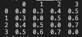
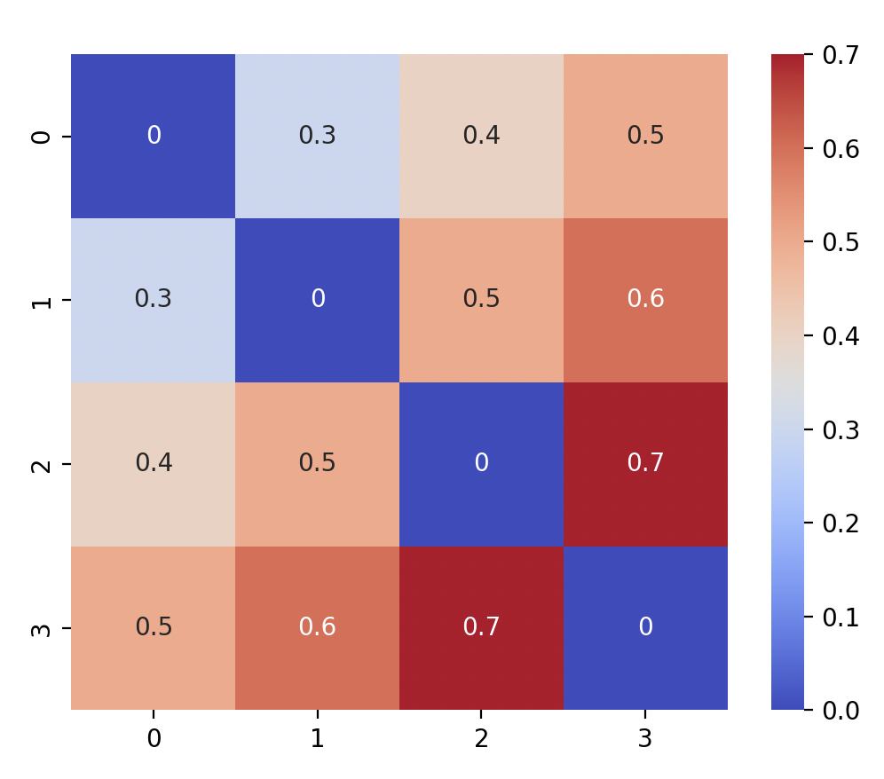
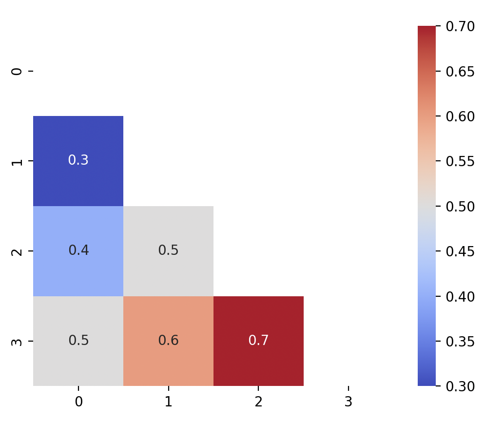
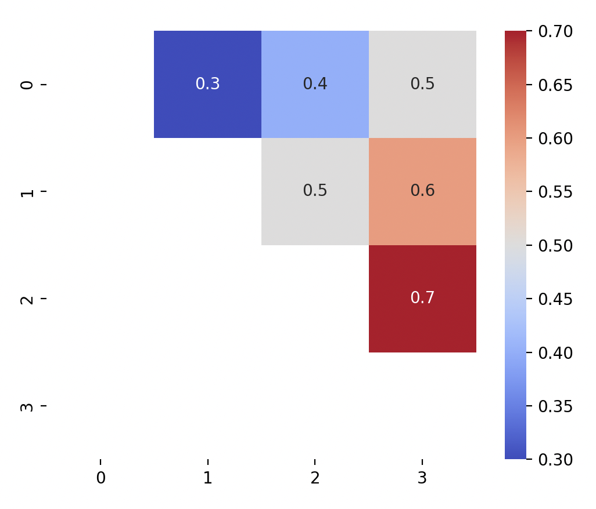

# PLotting Pairwise matrices

When comparing classes in a biological setting, pairwise matrices are a great way to visualise the relationship between these classes. I will be using simulated data to represent a hypothetical pairwise similarity between 4 groups. 

I will be showing you how to plot a heatmap of pairwise matrix and using the `mask` fucntion to reduce redundancy

## Prerequisite

* numpy
* pandas
* matplotlib
* seaborn

## Installation

None.

## Usage

1. Import libraries
    
    ```python
    import pandas as pd
    import numpy as np
    from matplotlib import pyplot as plt
    import seaborn as sns
    ```

    *Note: It's good practice to import numpy/pandas first, then matplotlib and seaborn*

2. Simulate a pairwise matrix
    
    ```python
    mtx = [[0, 0.3, 0.4, 0.5], [0.3, 0, 0.5, 0.6], [0.4, 0.5, 0, 0.7], [0.5, 0.6, 0.7, 0]]
    mtx = pd.DataFrame(mtx)
    print(mtx)
    ```
    
    

3. Plot the heatmap using seaborn

    ```python
    sns.heatmap(mtx, annot = True, cmap = "coolwarm", square = True)
    plt.show()
    ```

    You should see:

    

4. Since the top right triangle is the same as the bottom left. We can remove the top right by using a mask to remove the plots by using the `np.triu` function.

    ```python
    mask = np.triu(np.ones_like(mtx, dtype=bool))
    sns.heatmap(mtx, annot = True, cmap = "coolwarm", square = True, mask = mask)
    plt.show()
    ```

    

    Alternatively, if you want to mask the bottom left triangle instead, use `np.tril` instead.

    ```python
    mask = np.tril(np.ones_like(mtx, dtype=bool))
    sns.heatmap(mtx, annot = True, cmap = "coolwarm", square = True, mask = mask)
    plt.show()
    ```

    

5. You can then proceed to add other annotation features such as title, axis labels.
    
[back](../)