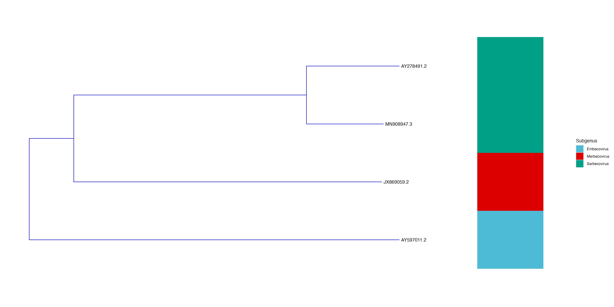

# Visualisation of phylogenetic tree using ggtree

> "But the difficulty is not nearly so great as it at first appears: all this beautiful work can be shown, I think, to follow from a few very simple instincts" - Charles Darwin, 24 November 1859, On the Origin of Species

Following up from inferrence of phylogenetic tree from [this tutorial](./tree.md), this tutorial will show how the tree can be visualised using R using `ggtree` and `ggtreeExtra`.

## Prerequisite 

* R
* ggplot2
* ggtree
* ggtreeExtra
* phangorn
* treeio
* ggnewscale

## Installation

```R
install.packages("ggplot2")
install.packages("phangorn")
BiocManager::install("ggtree")
BiocManager::install("ggtreeExtra")
BiocManager::install("treeio")
```

1. Import packages

    ```R
    library(ggplot2)
    library(ggtree)
    library(treeio)
    library(ggtreeExtra)
    library(phangorn)
    library(ggnewscale)
    ```

2. Import tree file

    Assuming your tree file is in the same working directory with the name `virus.newick`.

    ```R
    virustree <- read.newick("./virus.newick")
    ```

3. Optional: Get the midpoint of the tree

    If you want to midpoint root your tree. Do the following.

    ```R
    y <- midpoint(virustree)
    getRoot(y)
    ```

4. Plot the (rerooted) tree

    ```R
    p <- ggtree(y, color = "blue", layout = "rectangular")
    ```

    The layout parameter defaults to `"rectangular"`, change this to `"circular"` for larger datasets.

5. Add tree tips

    ```R
    p2 <- p + geom_tiplab()
    ```

    Visualise the tree

    ```R
    plot(p2)
    ```

    

    Looks quite good. But we can do better.


6. You can add more annotations to tree using metadata.

    Prepare a metadata csv file like the following:

    | ID | Name | Genus | Subgenus |
    | --- | --- | --- | --- |
    | AY597011.2 | HCoV-HKU1 | Betacoronavirus | Embecovirus|
    | JX869059.2 | MERS-CoV | Betacoronavirus | Merbecovirus |
    | MN908947.3 | SARS-CoV2 | Betacoronavirus | Sarbecovirus |
    | AY278491.2 | SARS-CoV | Betacoronavirus | Sarbecovirus |


    Import this csv to R.

    ```R
    meta <- read.csv("./meta.csv")
    ```

7. Now you can annotate the tree. In this example, the subgenus column is used.

    ```R
    p3 <- p2 + new_scale_fill() + 
            geom_fruit(data = meta, 
                      geom = geom_tile, 
                      mapping = aes(y = ID, fill = Subgenus),
            offset = 0.3, pwidth = 0.1) +
            scale_fill_manual(
          values=c("#4DBBD5FF", "#DC0000FF", "#00A087FF"))
    ```

    *Note: adjust the `offset` and `pwidth` and colours as defined in `scale_fill_manual` according personal taste*

8. Plot and save

    ```R
    plot(p3)
    ggsave("./lineage.png", p3, width = 20, height = 10)
    ```

    