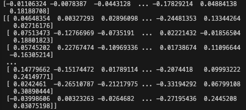

# Protein Language Models 

This is a gentle introduction and tutorial into Protein language models (PLMs). PLMs are large language models pre-trained on vast amounts of protein sequences, usually in a unsupervised fashion where no labels are given to the sequences. 
The model is tasked to discover and learn the semantics of the protein sequences, effectively understanding the language of proteins (i.e. amino acids). 

This tutorial will be covering the ESM2 PLM 650 million parameter model developed by Facebook AI Research. This tutorial shows how to extract the embeddings, a feature rich vector that describes the protein. There are lots of other PLMs available such as ProtBert.
I will be embedding the same Gyrase A (Accession: P9WG47) in previous posts as an example.

## Prerequisite 

* tensorflow
* pytorch
* SeqIO
* transformer
* numpy
* ESM2 installed locally somewhere

## Installation

* Get ESM2 [here](https://huggingface.co/facebook/esm2_t33_650M_UR50D)
* SeqIO
    ```sh
    pip install Bio
    ```
* Numpy ( *numpy should be installed during your tensorflow/pytorch installation* )

    ```sh
    pip install numpy
    ```
* transformers

    ```sh
    pip install transformers
    ```

## Usage

1. import required packages

    ```python
    import os
    os.environ['TF_CPP_MIN_LOG_LEVEL'] = '3' #this is optional

    import tensorflow as tf
    from transformers import AutoTokenizer, TFEsmModel
    import numpy as np
    from Bio import SeqIO
    ```

    *Note: importing `os` and `os.environ['TF_CPP_MIN_LOG_LEVEL'] = '3'` is optional as it only silences the warning logs generated*

2. Define a function that replaces `B, Z, J, U,` and `O` amino acids from your sequence into the unknown amino acid `X`.

    This is because ESM (and to a wider extent, other PLMS) works with the 20 common amino acids, uncommon amino acids may cause problems.

    ```python
    def formatseq(seq):
        seq = seq.replace("B", "X").replace("Z", "X").replace("J", "X").replace("U", "X").replace("O", "X")
        return seq
    ```

3. Set your environmental variables and intialise instance of the ESM2 model and tokenizer
    
    ```python
    modelDir = "PATH/TO/ESM2/INSTALLATION"
    tokenizer = AutoTokenizer.from_pretrained(modelDir)
    model = TFEsmModel.from_pretrained(modelDir)
    test_sequence = "./P9WG47.fa" #your sequence fasta file
    ```

4. Initialise an empty list to hold all your sequence strings.
    
    ```python
    seqs = []
    ```

5. Open the fasta file using `Bio.SeqIO` and append the strings into the empty list.

    ```python
    with open(test_sequence, "r") as readfile:
        for record in SeqIO.parse(readfile, "fasta"):
            seqs.append(str(record.seq))
    ```

    *Note: SeqIO.parse returns a `Seq` object when you run `Record.seq`; adding a `str()` will force it to be a regular string.*

6. Remap the uncommon acids (if any) to `X`
    
    ```python
    seqs = [formatseq(seq) for seq in seqs]
    ```

    *I know this is not the best or most pythonic way to map stuff, but it works.*

7.  Tokenize the sequence, feed it into the ESM2 model and retrieve the last hidden state. This is the embedding layer.
    
    ```python
    inputs = tokenizer(seqs, return_tensors="tf", padding= True, truncation= True, max_length = 1024) #return tf for tensorflow
    outputs = model(inputs)
    last_hidden_states = outputs.last_hidden_state
    per_residue_embeddings = np.array(last_hidden_states)
    ```

    This will yield a np array of size *num_of_sequence* * *length_of_protein* * *1280*

    *Note: ESM2 and its other sister models have the same input sequence limit of 1024 amino acids.*
    
    *Note2: Failure to comply to this 1024 aa limit **may** [poison your GPU](https://github.com/facebookresearch/esm/discussions/76). You have been warned*

8. Optional: Get the per protein embeddings
    
    Get the per protein emebeddings by averaging over the length of the sequence. This is dimension 1 of the numpy array.

    ```python
    #get per protein embeddings
    per_protein_embeddings = np.mean(per_residue_embeddings, axis=1)
    ```

9. View the embeddings and its shape.

    Running

    ```python
    #view shapes
    print(per_residue_embeddings.shape)
    print(per_protein_embeddings.shape)
    ```

    Will yield a result of `(1, 840, 1280)` and `(1, 1280)` respectively.

    Running
    ```python
    print(per_protein_embeddings[0])
    print(per_residue_embeddings[0])
    ```

    Will yield

    


    This numerical vector are the embeddings (both per residue, and per protein).
    They can be used as downstream features for model building or visualisation.


# Reference

1. https://www.science.org/doi/10.1126/science.ade2574

[back](../)