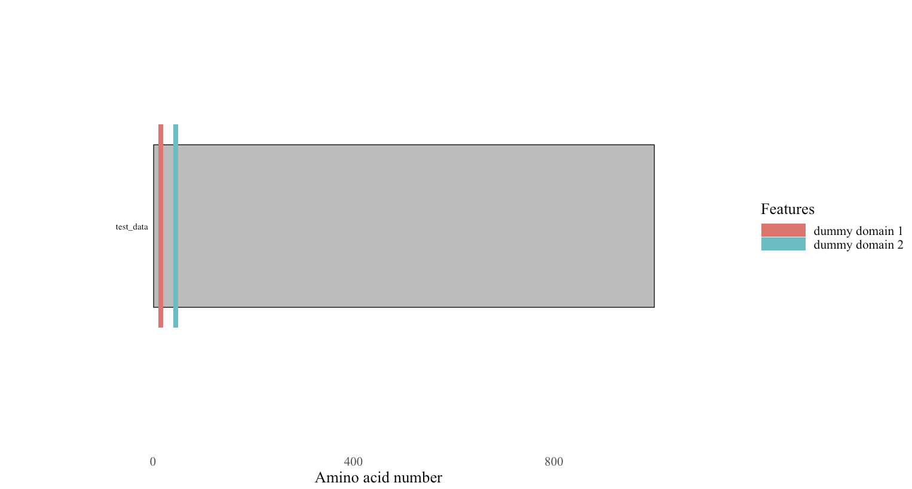
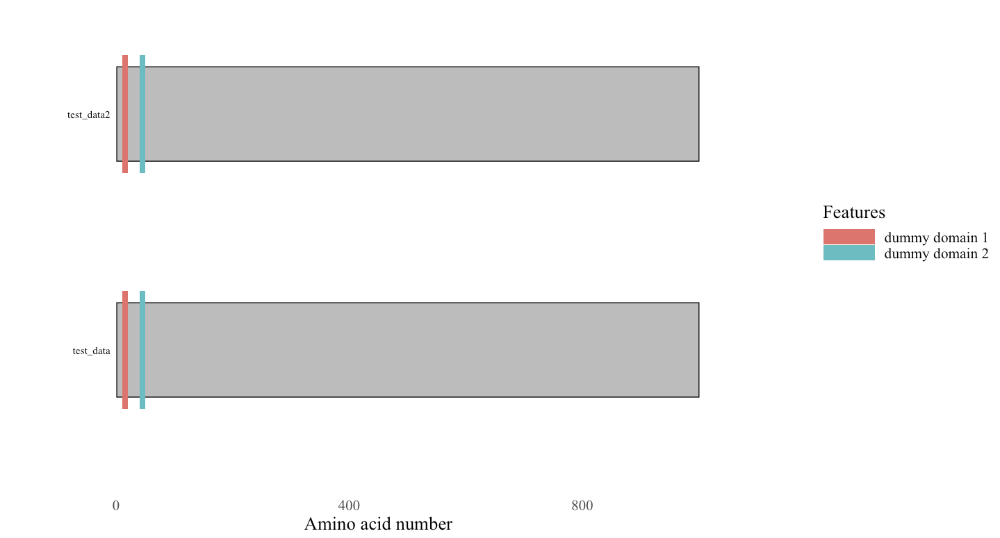

# Visualisation of protein domains architecture

Representing protein domain architecture is often used in research, especially when investigating unknown sequences.

They usually look like this.


However, the DOG1.0 appears to deprecated. [IBS2.0](https://academic.oup.com/nar/article/50/W1/W420/6586865) is an now available plotter for biological sequences, not just protein domains. 

Apart from manually drawing it by hand, you could programmatically and dynamically make these plots. However, currently available tools is limited to the R programming language. 

[drawProteins](https://www.bioconductor.org/packages/release/bioc/html/drawProteins.html) and [seqvisr](https://github.com/vragh/seqvisr) are two of such tools. I will be covering drawProteins and how to customise the plots by using the [BoNT/A (accession: Q7B8V4)](https://www.uniprot.org/uniprotkb/Q7B8V4/entry) from *C. botulinum* as an example.

## Prerequisite

* R (>=4.3.3) 

*testing on older versions worked without issues, but is not guaranteed*

## Usage

1. Load the packages 
    ```R
    library(drawProteins)
    library(ggplot2) #optional
    ```

2. Load in the data.

    By default, drawProteins can load uniprot to load the information. You will able to directly use the information from the annotation

    ```R
    json_dat <- get_features("Q7B8V4")
    df_dat <- feature_to_dataframe(json_dat)
    ```

    alternatively, load it in one go with
    ```R
    df_dat <- feature_to_dataframe(getfeatures("Q7B8V4"))
    ```

3. Intialise the ggplot canvas
    ```R
    p <- draw_canvas(df_dat)
    ```

4. Plot the chains and domains
    ```R
    p <- draw_chains(x, df_dat)
    p <- draw_domains(x, df_dat)
    ```

5. Optional: Modify the plot the remove background and change the theme, along with setting the font face. You will need ggplot2 imported

    ```R
    p + theme_bw(base_size = 20, base_family = "Times New Roman" )
    theme(panel.grid.minor=element_blank(), 
          panel.grid.major=element_blank()) +
    theme(axis.ticks = element_blank(), 
          axis.text.y = element_blank()) +
    theme(panel.border = element_blank()) +
    theme(legend.title = element_text(size = 20))
    ```

    
    

    *Note: the documentation is lacking, and doesn't cover other aspects of modfiying the plot*

    Remove the description on the domains by adding ` label_domains = FALSE` to  draw_domains
    ```R
    p <- draw_domains(x, df_dat, label_domains = FALSE)
    ```

    Change the legend title and key size
    ```R
    p <- p + guides(fill=guide_legend(title="Features", keywidth = unit(2, 'cm')))
    ```

    

    Set a colour palaette for your domains, using the okabe colour blind friendly set as example
    ```R
    okabe <- c("#D55E00", "#CC79A7", "#E69F00", "#009E73", "#0072B2")

    p <- p + scale_fill_manual(values = okabe)
    ```

    
    
    Note that the accession id on the left side is not `Times new roman`. This is because the `draw_chains` calls `ggplot` to annotate the file beforehand, it escapes the `theme_bw(base_family=font)` override command. We want define a new function, say `draw_chains_times` as

    ```R
    draw_chains_times <- function (p, data = data, outline = "black", fill = "grey", label_chains = TRUE, 
                               labels = data[data$type == "CHAIN", ]$entryName, size = 0.5, 
                               label_size = 4) 
    {
    begin = end = NULL
    p <- p + geom_rect(data = data[data$type == "CHAIN", 
    ], mapping = aes(xmin = begin, xmax = end, ymin = order - 
                                  0.2, ymax = order + 0.2), colour = outline, fill = fill, 
    size = size)
    if (label_chains == TRUE) {
        p <- p + annotate("text", x = -10, y = data[data$type == "CHAIN", ]$order, 
                                   label = labels, 
                                   hjust = 1, 
                                   size = label_size, 
                                   family = "Times")
    } 
    return(p)
    }
    ```

    *Note: if you have already imported `ggplot2`, do not add `ggplot2::` in front of `geom_rect` and `annotate` in the custom function*

    Now intsead of calling `draw_chains`, call `draw_chains_times` or any other name you have defined in this custom function.

6.  You can plot custom proteins in case Uniprot annotation is not up to your taste/not available.

    This is done by injecting a dataframe in this format:

    | rowname | type | description | begin | end | length | accession | entryName | taxid | order
    | -------- | ------- | -------- | ------- | -------- | ------- | -------- | ------- | -------- | ------- |
    | 1 | CHAIN | dummy | 1 | 1000 | 1000 | test_dummy | test_data | 1 | 1
    | 2 | DOMAIN | dummy domain 1 | 10 | 20 | 10 | dummy domain | dummy domain | 1 | 1 |
    | 3 | DOMAIN | dummy domain 2 | 40 | 50 | 10 | dummy domain | dummy domain | 1 | 1 |

    this represents a protein of size 1000, with two domains at 10-20 aa and 40-50 aa. I have placed taxid as 1 as placeholder

    Assuming your data is in a file called `dummy_data.txt` in the same current working directory.
    ```R
    library(data.table)
    df_dat <- data.frame(fread("./dummy_data.txt"), row.names = 1)
    ```

    `row.names = 1` means the first column is the row names.

    Now plot as you would in the previous example.

    

    This can be extended to plot multiple proteins.

    | rowname | type | description | begin | end | length | accession | entryName | taxid | order
    | -------- | ------- | -------- | ------- | -------- | ------- | -------- | ------- | -------- | ------- |
    | 1 | CHAIN | dummy | 1 | 1000 | 1000 | test_dummy | test_data | 1 | 1
    | 2 | DOMAIN | dummy domain 1 | 10 | 20 | 10 | dummy domain | dummy domain | 1 | 1 |
    | 3 | DOMAIN | dummy domain 2 | 40 | 50 | 10 | dummy domain | dummy domain | 1 | 1 |
    | 4 | CHAIN | dummy | 1 | 1000 | 1000 | test_dummy | test_data2 | 1 | 2
    | 5 | DOMAIN | dummy domain 1 | 10 | 20 | 10 | dummy domain | dummy domain | 1 | 2 |
    | 6 | DOMAIN | dummy domain 2 | 40 | 50 | 10 | dummy domain | dummy domain | 1 | 2 |

    By adding to the `order` row, you can plot multiple proteins.

    *Note: plots are made from bottom up. Keep that in mind.*

    

# Reference

1. https://f1000research.com/articles/7-1105/v1

[back](../)